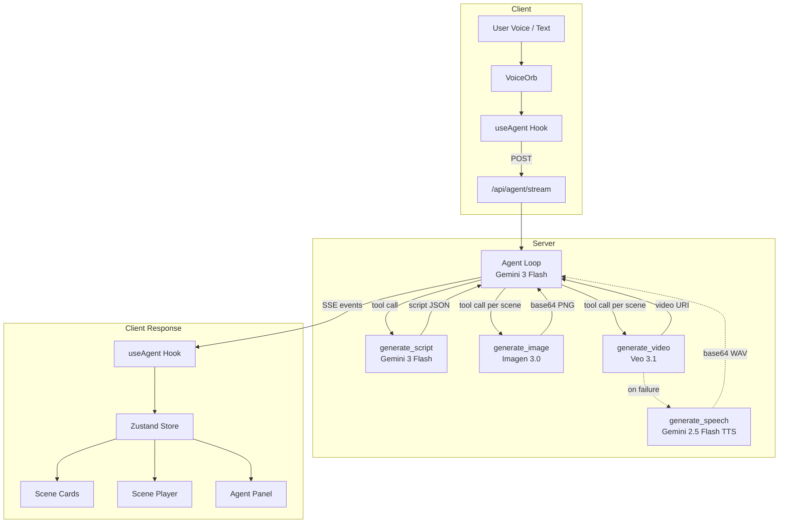

# SayCut

Voice-first AI movie director. Speak a story idea and watch it become a cinematic short film with generated visuals, video, and audio.

Built with Next.js, Google GenAI (Gemini, Imagen, Veo), Zustand, and Framer Motion for the Google DeepMind multi-model hackathon.

## Data Flow



## Agent Tools

| Tool | Model | Input | Output |
|------|-------|-------|--------|
| `generate_script` | Gemini 3 Flash | Story description, scene count | Structured script with scenes (title, narration, visual description, dialogue directions) |
| `generate_image` | Imagen 3.0 | Scene ID, visual description | Keyframe image (base64 PNG) |
| `generate_video` | Veo 3.1 | Scene ID, visual + audio directions | 6s cinematic video clip with native audio (720p, 16:9) |
| `generate_speech` | Gemini 2.5 Flash TTS | Scene ID, narration text | Narration audio (base64 WAV) — fallback when video generation fails |

### Pipeline Sequence

1. **Script** — Agent calls `generate_script` once to produce a structured multi-scene screenplay
2. **Image** — Agent calls `generate_image` for each scene to create a keyframe
3. **Video** — Agent calls `generate_video` for each scene (polls up to 120s); falls back to `generate_speech` on failure
4. **Playback** — Client auto-plays scenes sequentially in a full-screen player

## Quick Start

```bash
# Install dependencies
npm install

# Set your Google API key
echo 'GOOGLE_API_KEY=your-key-here' > .env.local

# Start dev server
npm run dev
```

Open [http://localhost:3000](http://localhost:3000), click the voice orb or type a story idea, and watch SayCut direct your film.

## Project Structure

```
src/
├── agent/
│   ├── agent.ts              # Agentic loop (Gemini function calling, max 6 rounds)
│   ├── system-prompt.ts      # Agent behavior instructions
│   └── tools/                # Tool implementations + declarations
├── app/
│   ├── api/agent/stream/     # SSE endpoint (5-min timeout)
│   └── page.tsx              # Root page
├── components/               # AppShell, VoiceOrb, SceneCard, ScenePlayer, AgentPanel
├── hooks/                    # useAgent (SSE consumer), useAudioRecorder
├── stores/                   # Zustand project store (scenes, messages, playback)
└── lib/                      # GenAI client, constants, types
```
