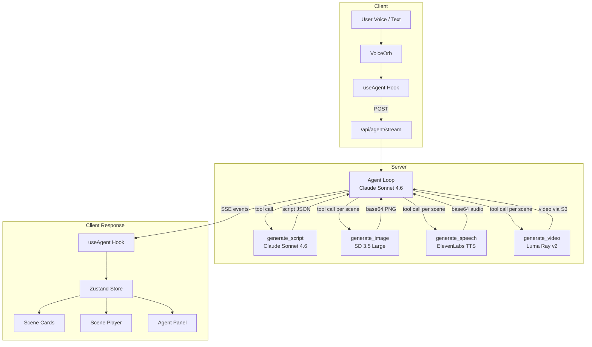

# SayCut

Voice-first AI movie director. Speak a story idea and watch it become a cinematic short film with generated visuals, narration, and video.

Built with Next.js, AWS Bedrock (Claude, Stable Diffusion, Luma Ray), ElevenLabs TTS, Zustand, and Framer Motion for the Google DeepMind multi-model hackathon.

## Data Flow



## Agent Tools

| Tool | Model | Input | Output |
|------|-------|-------|--------|
| `generate_script` | Claude Sonnet 4.6 (Bedrock Converse) | Story description, scene count | Structured script with scenes (title, narration, visual description, dialogue directions) |
| `generate_image` | Stable Diffusion 3.5 Large (Bedrock InvokeModel) | Scene ID, visual description | Keyframe image (base64 PNG) |
| `generate_speech` | ElevenLabs Multilingual v2 (DigitalOcean Model Access) | Scene ID, narration text | Narration audio (base64 MP3) |
| `generate_video` | Luma Ray v2 (Bedrock async invoke) | Scene ID, visual + audio directions | 6s cinematic video clip (720p, 16:9) via S3 |

### Pipeline Sequence

1. **Script** -- Agent calls `generate_script` once to produce a structured multi-scene screenplay
2. **Image + Speech** -- Agent calls `generate_image` and `generate_speech` in parallel for each scene
3. **Video** -- Agent calls `generate_video` for each scene (polls up to 5 min, downloads from S3)
4. **Playback** -- Client auto-plays scenes sequentially in a full-screen cinematic player

### Resilience

- **Retry with backoff** -- Bedrock API calls (ThrottlingException, ServiceUnavailableException, ModelTimeoutException) retry up to 3 times with exponential backoff (2s, 4s, 8s)
- **Parallel tool execution** -- Tools run concurrently via `Promise.allSettled()`; one failure doesn't block others
- **Base64 stripping** -- Tool results fed back to the LLM have base64 data URIs truncated to avoid context bloat
- **Structured logging** -- All tool calls and API interactions are logged with timestamps, scopes, and durations (`[saycut]` prefix)

### Persistence

Scenes and messages are persisted to **IndexedDB** via Zustand's `persist` middleware. Base64 images and audio survive page refreshes without hitting localStorage's 5MB limit. Transient UI state (streaming, recording, playback) is not persisted.

## Quick Start

```bash
# Install dependencies
npm install

# Configure AWS credentials (uses the "tokenmaster" profile)
# Ensure ~/.aws/credentials has a [tokenmaster] profile with Bedrock access

# Set environment variables
cat > .env.local << 'EOF'
AWS_REGION=us-west-2
SAYCUT_VIDEO_S3_BUCKET=saycut-video-output
DIGITAL_OCEAN_MODEL_ACCESS_KEY=your-key-here
EOF

# Start dev server
npm run dev
```

Open [http://localhost:3000](http://localhost:3000), click the voice orb or type a story idea, and watch SayCut direct your film.

## Project Structure

```
src/
├── agent/
│   ├── agent.ts              # Agentic loop (Bedrock Converse, max 6 rounds)
│   ├── system-prompt.ts      # Agent behavior instructions
│   └── tools/                # Tool implementations + declarations
├── app/
│   ├── api/agent/stream/     # SSE endpoint (5-min timeout)
│   └── page.tsx              # Root page
├── components/               # AppShell, VoiceOrb, SceneCard, ScenePlayer, AgentPanel
├── hooks/                    # useAgent (SSE consumer), useAudioRecorder
├── stores/                   # Zustand project store (scenes, messages, playback)
└── lib/                      # Bedrock client, S3 client, constants, types, logger, IDB storage
```
