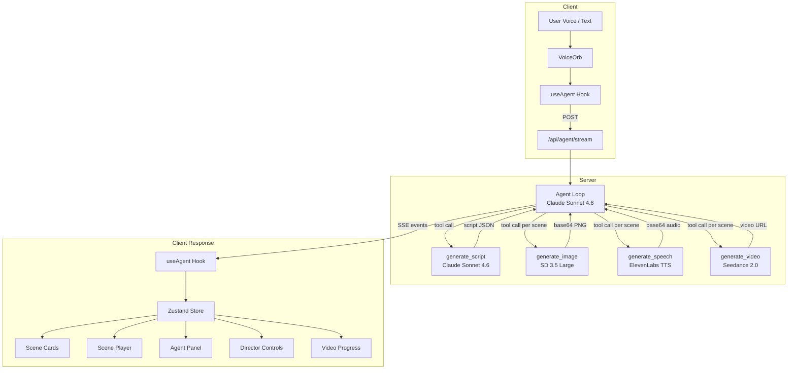

# SayCut

Voice-first AI movie director. Speak a story idea and watch it become a cinematic short film with generated visuals, narration, and video.

Built with Next.js, AWS Bedrock (Claude, Stable Diffusion), **Seedance 2.0** for video generation, ElevenLabs TTS, Zustand, and Framer Motion.

## Data Flow



## Agent Tools

| Tool | Model | Input | Output |
|------|-------|-------|--------|
| `generate_script` | Claude Sonnet 4.6 (Bedrock Converse) | Story description, scene count | Structured script with scenes (title, narration, visual description, dialogue directions) |
| `generate_image` | Stable Diffusion 3.5 Large (Bedrock InvokeModel) | Scene ID, visual description | Keyframe image (base64 PNG) |
| `generate_speech` | ElevenLabs Multilingual v2 (DigitalOcean Model Access) | Scene ID, narration text | Narration audio (base64 MP3) |
| `generate_video` | Seedance 2.0 (REST API) | Scene ID, visual + audio directions, director settings, optional first-frame | Cinematic video clip (configurable duration/resolution/aspect ratio) |

### Pipeline Sequence

1. **Script** — Agent calls `generate_script` once to produce a structured multi-scene screenplay
2. **Image + Speech** — Agent calls `generate_image` and `generate_speech` in parallel for each scene
3. **Video** — Agent calls `generate_video` for each scene with scene chaining (last frame → first frame continuity)
4. **Playback** — Client auto-plays scenes sequentially in a full-screen cinematic player

### Key Features

- 🔗 **Scene Chaining** — Last frame of scene N automatically becomes the first frame of scene N+1 for visual continuity
- 🎥 **Director Controls** — Configurable duration (5/10s), resolution (480p–1080p), aspect ratio (16:9, 9:16, 1:1, 4:3, 3:4), camera lock, audio reactivity, seed
- ⏳ **Enhanced Waiting Experience** — Ken Burns effect on keyframe image + multi-stage progress bar with ETA while video generates
- 🧪 **72 unit tests** across 5 test suites, all passing

### Resilience

- **Retry with backoff** — API calls retry up to 3 times with exponential backoff (2s, 4s, 8s)
- **Parallel tool execution** — Tools run concurrently via `Promise.allSettled()`; one failure doesn't block others
- **Base64 stripping** — Tool results fed back to the LLM have base64 data URIs truncated to avoid context bloat
- **Structured logging** — All tool calls and API interactions are logged with timestamps, scopes, and durations (`[saycut]` prefix)

### Persistence

Scenes and messages are persisted to **IndexedDB** via Zustand's `persist` middleware. Base64 images and audio survive page refreshes without hitting localStorage's 5MB limit. Transient UI state (streaming, recording, playback) is not persisted.

## Quick Start

```bash
# Install dependencies
npm install

# Configure AWS credentials (uses the "tokenmaster" profile)
# Ensure ~/.aws/credentials has a [tokenmaster] profile with Bedrock access

# Set environment variables
cat > .env.local << 'ENV'
AWS_REGION=us-west-2
SEEDANCE_API_KEY=your-seedance-api-key
SEEDANCE_BASE_URL=https://open.volcengineapi.com        # optional
SEEDANCE_MODEL_ENDPOINT_ID=seedance-2-0-lite-t2v        # optional
DIGITAL_OCEAN_MODEL_ACCESS_KEY=your-key-here
ENV

# Start dev server
npm run dev

# Run tests
npm run test
```

Open [http://localhost:3000](http://localhost:3000), click the voice orb or type a story idea, and watch SayCut direct your film.

## Project Structure

```
src/
├── agent/
│   ├── agent.ts              # Agentic loop (Bedrock Converse, max 6 rounds)
│   ├── system-prompt.ts      # Agent behavior instructions
│   └── tools/                # Tool implementations + declarations
│       ├── index.ts          # Tool registry, scene chaining & director settings wiring
│       ├── generate-script.ts
│       ├── generate-image.ts
│       ├── generate-speech.ts
│       └── generate-video.ts # Seedance 2.0 video generation
├── app/
│   ├── api/agent/stream/     # SSE endpoint (5-min timeout)
│   └── page.tsx              # Root page
├── components/
│   ├── app-shell.tsx         # Main layout
│   ├── voice-orb.tsx         # Voice input
│   ├── scene-card.tsx        # Scene display cards
│   ├── scene-player.tsx      # Full-screen cinematic player
│   ├── agent-panel.tsx       # Agent conversation panel
│   ├── director-controls.tsx # Expandable director settings panel
│   └── video-progress.tsx    # Ken Burns + multi-stage progress UI
├── hooks/
│   ├── use-agent.ts          # SSE consumer, scene chaining state
│   └── use-audio-recorder.ts # Microphone recording
├── stores/                   # Zustand project store (scenes, messages, playback)
└── lib/
    ├── seedance-client.ts    # REST client for Seedance 2.0 API
    ├── scene-chaining.ts     # Last-frame extraction & first-frame pinning
    ├── director-controls.ts  # Configurable generation settings
    ├── bedrock.ts            # AWS Bedrock client (Claude, SD)
    ├── constants.ts          # Model IDs, config
    ├── types.ts              # TypeScript interfaces
    ├── logger.ts             # Structured logging
    └── idb-storage.ts        # IndexedDB persistence adapter
```

## Testing

```bash
npm run test          # Run all 72 tests
npm run test:watch    # Watch mode
npx tsc --noEmit     # Type check
```
